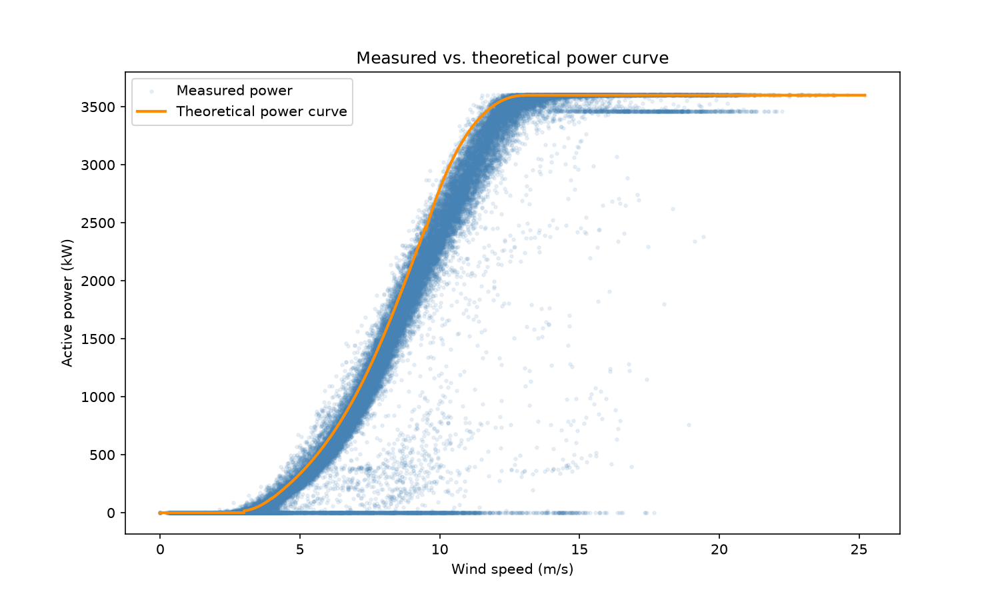
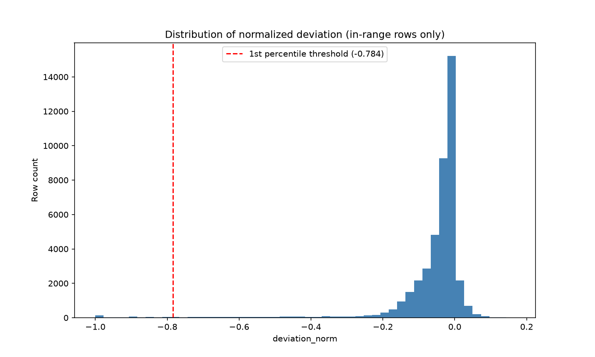
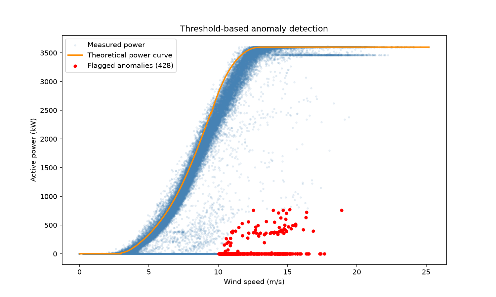

# Wind Turbine Digital Twin (TurbineTwin)

A prototype digital twin for wind turbine anomaly detection, built on real
SCADA data from a wind farm in Turkey (2018, 10-minute resolution, ~50k
records). Compares actual power output against the manufacturer's theoretical
power curve to flag deviations from design behavior — the same problem
described by Eksim Enerji's approach to digital twin technology: detecting
when equipment drifts from its design values.

## Why this approach

The dataset ships with a manufacturer-provided theoretical power curve, so
"expected output" doesn't need to be modeled — anomaly detection reduces
directly to measuring `actual vs. theoretical` deviation. The core design
decisions:

- **Deviation is normalized by rated power** (`(actual - theoretical) /
  rated_power`), not by the theoretical value itself. Dividing by the
  theoretical value blows up near cut-in, where it approaches zero —
  confirmed live during development (`inf`/`NaN` from division by near-zero).
  A constant, nonzero denominator makes that failure structurally impossible.
- **Cut-in/cut-out wind speeds define a trust boundary, not just a filter.**
  Outside this range the turbine is expected to sit idle by design, not by
  fault — flagging deviations there would be flagging the turbine for
  behaving correctly.
- **The anomaly threshold is derived from the data** (1st percentile of
  in-range deviation), not hardcoded, and compared against a mean−3σ
  alternative that turned out to flag 2.7x more rows due to the deviation
  distribution's skew.
- **A rule-based detector is compared against sklearn's Isolation Forest**
  trained on the same in-range data. They agree on only 39% of flagged rows —
  Isolation Forest flags rare-but-healthy high-wind operation (statistical
  rarity), while the rule-based approach flags genuine underperformance
  relative to the design curve. See `NOTLAR.md` for the full analysis.

## Setup

```powershell
py -3.14 -m venv .venv --system-site-packages
.\.venv\Scripts\Activate.ps1
pip install -r requirements.txt
```

## Dataset

See [data/raw/README.md](data/raw/README.md) for download instructions.

## Running

```powershell
$env:PYTHONPATH = "src"
python scripts/run_phase1.py
pytest tests/
```

This loads the data, reports data quality, computes deviation metrics, derives
an anomaly threshold, flags anomalies, and compares against Isolation Forest —
saving three figures to `outputs/figures/`.

### API server

```powershell
$env:PYTHONPATH = "src"
uvicorn turbinetwin.api:app --reload
```

Serves at `http://127.0.0.1:8000`. Interactive docs at `/docs`.

### Dashboard

Open `http://127.0.0.1:8000/` (same server, same command as above) for a
live dashboard: a power-curve chart, a status panel (wind speed, measured
power, deviation %, normal/idle/anomaly state), playback speed controls
(1x/10x/100x), and a running list of anomalies seen in the current session.
Plain HTML/JS (Chart.js via CDN, `EventSource` for the stream) — no build
step, no `npm install`.

- `GET /api/health` — readiness check, reports rows loaded at startup.
- `GET /api/window?start=0&limit=100` — a slice of the dataset as JSON,
  validated against the `TurbinePoint` schema.
- `GET /api/stream?speed=1|10|100` — replays the full dataset in timestamp
  order as Server-Sent Events, at 1x/10x/100x the original 10-minute
  cadence. See `NOTLAR.md` Step 2.8 for why 100x measures closer to ~54x in
  practice (Windows timer resolution).
- `GET /api/ask?timestamp=...` — rule-based RAG: explains whether a given
  reading was flagged as an anomaly and, if so, whether it overlaps a
  (synthetic) logged maintenance window or looks like a genuine,
  unexplained underperformance. Click a row in the dashboard's anomaly
  list to try it. See `NOTLAR.md` Phase 4 for why "generation" here is a
  template rather than an LLM call.

## Results

**Power curve** — measured output vs. the theoretical curve. The S-curve,
cut-in knee (~3 m/s), and rated plateau (3600 kW) are visible, along with a
dense underperformance cloud in the 5-12 m/s range.



**Deviation distribution** — normalized deviation across in-range rows, with
the derived 1st-percentile threshold marked. The distribution is skewed: a
short tail down to -1.0 accounts for why percentile-based thresholding was
chosen over mean−3σ.



**Flagged anomalies** — 428 rows (≈1% of in-range data) cluster almost
entirely in the 10-19 m/s band at near-zero power, despite the theoretical
curve predicting 2000-3600 kW there.



## Project structure

```
src/turbinetwin/   # core logic: data loading, deviation metrics, anomaly
                   # detection, plotting -- reused by later phases (API, MCP)
static/            # dashboard: plain HTML/JS, served by the API itself
scripts/           # entry points
data/              # raw (gitignored) and processed data, plus the
                   # synthetic maintenance log used by /api/ask
outputs/figures/   # generated plots (gitignored)
tests/             # sanity tests
NOTLAR.md          # detailed decision log and interview prep notes
```

## Future work

The current API replays historical data (the full 2018 dataset, played back
in timestamp order) rather than ingesting live measurements. Extending it to
accept a real, continuously arriving feed (e.g. a new reading every 10
minutes from an actual turbine) was considered and deliberately scoped out:
it would require the in-memory `STATE` to become mutable under concurrent
access — read by every request handler, written by whatever ingests new
readings — which needs proper concurrency handling (locking or a
message-queue-backed pipeline such as Kafka/RabbitMQ) to avoid race
conditions. That's real infrastructure work, not a prototype-scale addition,
so it was left out rather than half-implemented.

## Status

Phase 1 (data + model), Phase 2 (FastAPI streaming service), Phase 3
(dashboard), and Phase 4 (rule-based RAG for anomaly explanations)
complete. See `NOTLAR.md` for the full decision log.
